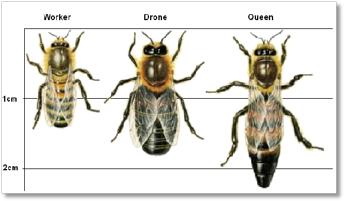
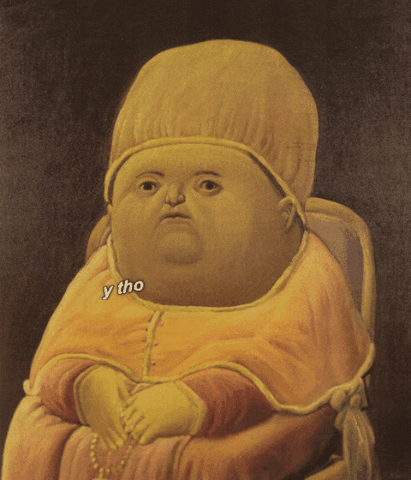
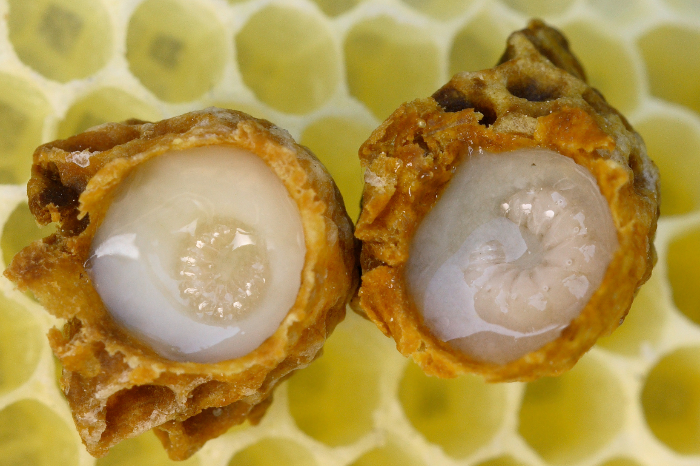
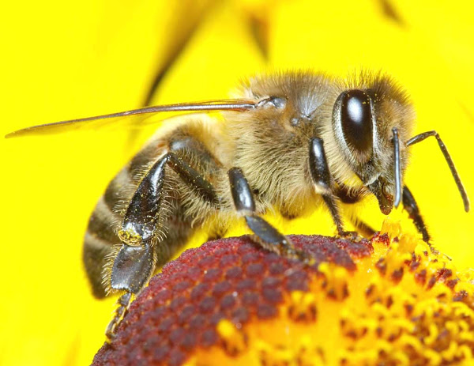
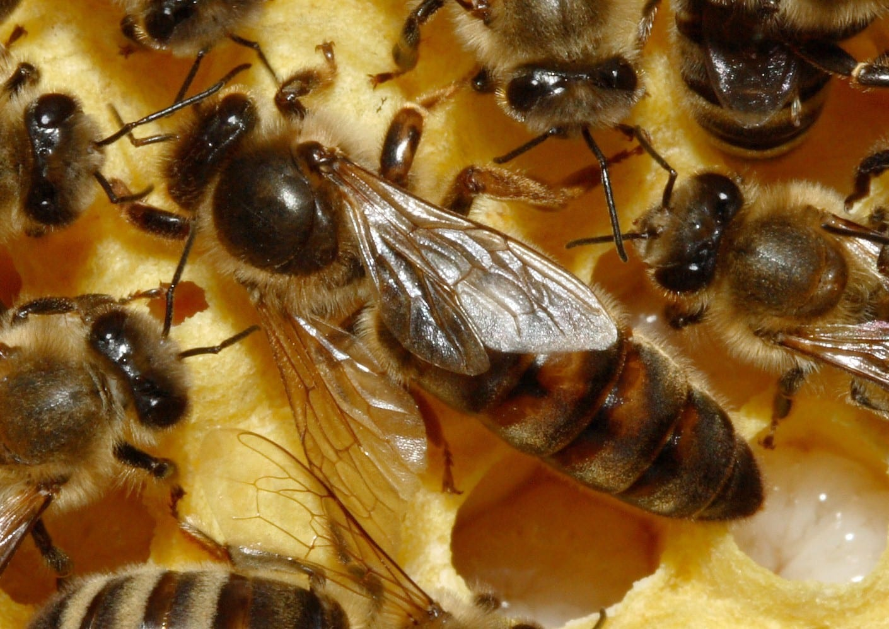
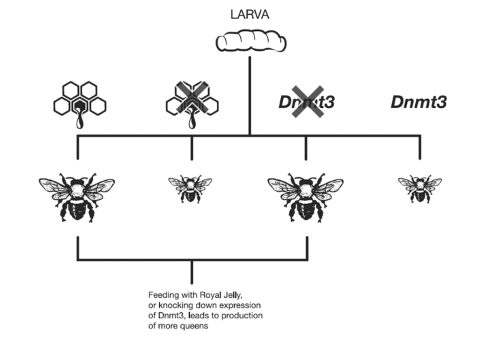
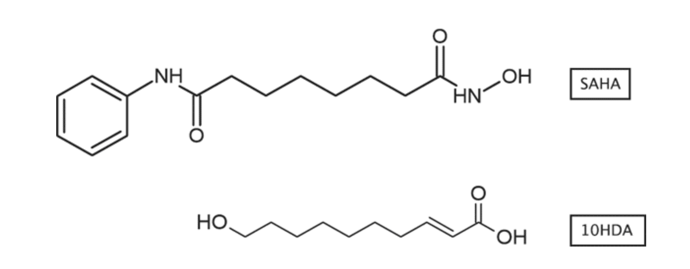
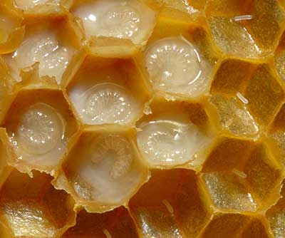

import { Head, Notes } from 'mdx-deck'
export { yellow as theme } from 'mdx-deck/themes'

<Head>
  <title>Chapter 14: Long Live the Queen</title>
</Head>

# Chapter 14

## Long Live the Queen

<Notes>

Chapter focuses on honey bees and how research on them
have uncovered some interesting information on
how diet can play a large role on development
and epigenetics can vary across species.

Presentation will start with a brief review on bees,
then go into some of the research done on them and what
that research uncovered.

</Notes>

---

## Bees

Have colonies with different social roles

- Female Worker bees
- A small amount of male bees (aka Drones)
- The Queen

<Notes>

Quick overview of bees here.

Worker bees collect pollen and nectar. They make wax.

Drones are only really there to mate.

Make note that the queen is quite different and lead into next slide.

</Notes>

---

## The Queen

- Genetically identical to thousands of other worker bees
  but develop quite differently.
- Much larger than than worker bees.
- No sting barbs, wax glands, or pollen baskets.
- Only type of female that can mate.
- Can live for years, whereas worker bees can
  only live a few months.

<Notes>

Because queens mate several times, not all bees are
genetically identical to each other, but in a colony
thousands of them can be.

Make note that the queen is interesting because it's quite different from
the others (larger, only female that can mate).

Fun fact: lifespan of worker bees varies depending
on the season they were born.

</Notes>

---

<Notes>

Despite being genetically identical to other workers,
why is the queen different?

</Notes>

---

## Royal Jelly

- All larvae are fed this for the first 2 days of life.
- On the 3rd day, most larvae are switched to a diet of pollen and nectar.

<Notes>
  Lead into next slide, showing that most of these bees become workers.
</Notes>

---

## Worker bee

<Notes>These bees will go on to support the colony.</Notes>

---

## The rest of them

The others remain on the royal jelly diet and grow up to become queens.

<Notes>

The new queens eventually leave the hive with drones
and workers to start a new colony.

Not quite sure what exactly causes nurse bees to continue feeding royal
jelly to a select few.

</Notes>

---

<Notes>

But why does the prolonged jelly diet make them queens?

</Notes>

---

## Research back in 2006

- Some researchers decided to sequence the genomes of honey bees.
- Found that the genome contained genes that looked
  similar to DNA methyltransferase genes of higher organisms.
- Genome showed to contain a lot of CpG motifs.

<Notes>

This provides evidence that honeybees may possess a DNA methylation system.

DNA methyltransferase - enzymes that catalyze the transfer
of a methyl group from S-Adenosyl methionine. These enzymes are required for
the establishment and maintenance of DNA methylation patterns

CpG motifs (CpG patterns)

`cytosine triphosphate deoxynucleotide` ("C")
followed by a `guanine triphosphate deoxynucleotide` ("G").
The "p" refers to the `phosphodiester` link between consecutive nucleotides.

Cytosines can be methylated and turn off gene expression.

Potential evidence that bees have a dna methylation system?

</Notes>

---

## More research back in 2006

- Research group led by Gene Robinson in Illinois found that
  DNA methyltransferase proteins encoded in the genome were active.
- Proteins were able to add methyl groups to the cytosine
  residue in a CpG motif.
- There were also proteins expressed that were able to bind to methylated DNA.

<Notes>

Together, this shows that cells could both read and write epigenetic code.

Before this data was published, no one thought to
check if honey bees they had a DNA methylation system
because everyone kind of thought that it would be similar to the fruit fly
`Drosophila melanogaster`

</Notes>

---

## Even more research

Dr. Ryszard Maleszka and his colleagues (Austrailian National University
in Canberra) discovered that by switching off the `Dnmt3` gene,
they could create queen bees without prolonged feeding with royal jelly.

<Notes>

`Dnmt3` is responsible for adding methyl groups to regions of DNA that
haven't been methylated before.

Because knocking down `Dnmt3` had the same effects of feedling royal jelly.

This suggests that royal jelly is connected to alterations of the
DNA methylation patterns on important genes.

If Dnmt3 is suppressed by royal jelly there is less methylation in the queen.
Methylation generally turns off expression of genes. So the royal
jelly is likely allowing some genes to stay turned on to develop into
a queen and when those genes are turned off by methylation they become workers.

The researchers also examined the DNA methylation and gene expression patterns
in different experimental groups of bees to back up the hypothesis
and found that the methylation patterns between natural queen bees and
the knockdown queen bees were very similar.

</Notes>

---

## Gaps

No one has been able demonstrate that royal jelly really inhibits the
DNA methyltransferase enzyme, it's possible that the
effect of royal jelly on DNA methylation is indirect.

<Notes>No one knows what exactly is causing the enzyme to be inhibited.</Notes>

---

## What we do know

- Royal jelly does influence on hormonal signalling in honey bees
  and this changes gene expression patterns.
- Epigenetic modifications influence the expression of a gene
- Histones can be modified to promote gene expression,
leading genes to be turned on.

<Notes>

Something similar may be happening for honeybees.

DNA methylation systems and histone modification systems often work together.
This his stirred up interest in the role of histone modifying enzymes in
the control of honeybee development.

4 histone deacetylase enzymes were identified in the honeybee genome.

Interesting because, it was known for some time that royal jelly contains a
compound called `phenyl butyrate`. It was known that this can
inhibit histone deacetylases but does it weakly.

</Notes>

---

## 10HDA and SAHA

In 2011, a group led by Dr. Mark Bedford from the MD Anderson Cancer Center
in Houston published a study on royal jelly.

Found that it contained compound called `10HDA`
(_(E)-10-hydroxy-2-decnoic acid_).

The structure is similar to another compound known as `SAHA`,
a histone deacetylase inhibitor.

<Notes>
Structures aren't identical.

SAHA is licensed for the treatment of cancer

Researchers hypothesized that 10HDA may be an inhibitor of histone deacetylases.
After a number of experiments, it was found that this is indeed the case.

Acetylation makes the DNA be less tightly wound around the histones
and turns on gene expression. deacetylation does the opposite,
by removing the acetyl groups the DNA is wound tighter
and expression is turned off.

</Notes>

---

This stuff inhibits a key class of epigenetic enzymes.

<Notes>

Royal jelly has a history being used as a health supplement.

It was discovered that `10HDA` compound (that Mark Bedford's group found)
can affect the growth of blood vessel cells.

Theoretically, this can be useful in cancer since tumors rely
in a good blood supply for growth.

But we a very long way from showing that royal jelly can actually
fight off cancer or provide any health benefits.

</Notes>

---

## Other epigenetic influences

- It was found that levels of `Dnmt3` protein go up in parts
  of the honeybee's brain which are important to learning.
- Inhibition of `Dmnt3` alters memory retention and causes bees to
  forget things faster.

<Notes>
Dr. Ryszard Maleszka's group
(going back to the group that found that the `Dmnt3`)
found that it was possible to train honeybees to respond to certain
stimuli associted with food.

Unclear which genes become methylated when honey bees learn and
acquire new memories.

</Notes>

---

## How does this relate to us?

- DNA methylation is associated with alterations in developmental
  processes for both humans and honeybees.
- DNA methylation also plays a role in the brain during memory processing.

<Notes>

However there are differences... (next slide)

</Notes>

---

## Differences in how DNA methylation is used

In mammals, DNA methylation tends to be associated with switching
off gene expression and shutting down dangerous elements that
might cause problems.

In honeybees, it tends to act as a fine tuning mechanism,
modulating the activity of genes.

Humans and bees are not the same epigenetically.

---

Shoutout to Doryan for switching spots with me
and Steve for the helpful feedback.

https://epigenetics-revolution-ch-14-deck.charlieduong94.now.sh
